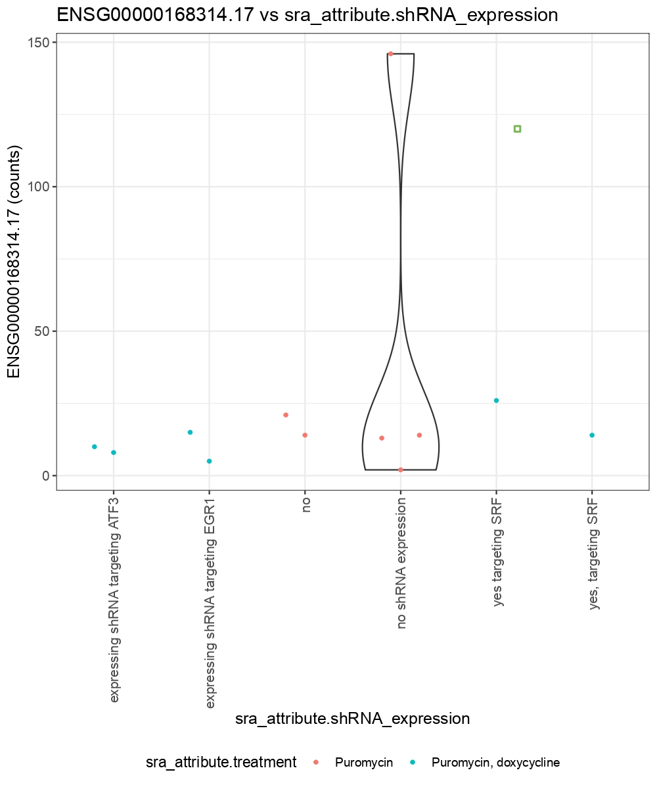

```{r, eval = FALSE}
library("recount3")

## Revisemos todos los proyectos con datos de humano en recount3
human_projects <- available_projects()

## Encuentra tu proyecto de interés. Aquí usaremos
## SRP009615 de ejemplo
proj_info <- subset(
  human_projects,
  project == "SRP009615" & project_type == "data_sources"
)
## Crea un objetio de tipo RangedSummarizedExperiment (RSE)
## con la información a nivel de genes
rse_gene_SRP009615 <- create_rse(proj_info)

## Explora los proyectos disponibles de forma interactiva
proj_info_interactive <- interactiveDisplayBase::display(human_projects)
## Selecciona un solo renglón en la tabla y da click en "send".

## Aquí verificamos que solo seleccionaste un solo renglón.
stopifnot(nrow(proj_info_interactive) == 1)
## Crea el objeto RSE
rse_gene_interactive <- create_rse(proj_info_interactive)

assay(rse_gene_SRP009615, "counts") <- compute_read_counts(rse_gene_SRP009615)

rse_gene_SRP009615 <- expand_sra_attributes(rse_gene_SRP009615)
colData(rse_gene_SRP009615)[
  ,
  grepl("^sra_attribute", colnames(colData(rse_gene_SRP009615)))
]

iSEE::iSEE(rse_gene_SRP009615)

```

Parámetros que se modificaron:
- Y-axis feature se cambió por el ID requerido
- X-axis se seleccionó por column data y se seleccionó el atributo shRNA_expression
- Color by column data y se seleccionó treatment

Resultado final:


